<h1 align="center">🌿 NutriLens — AI-Powered Nutrition & Wellness Assistant</h1>

<p align="center">
  <strong>Team ID:</strong> TM180 · <strong>Team Name:</strong> BitByBit  
  <br>
  Empowering smarter, healthier living through AI.
</p>

<p align="center">
  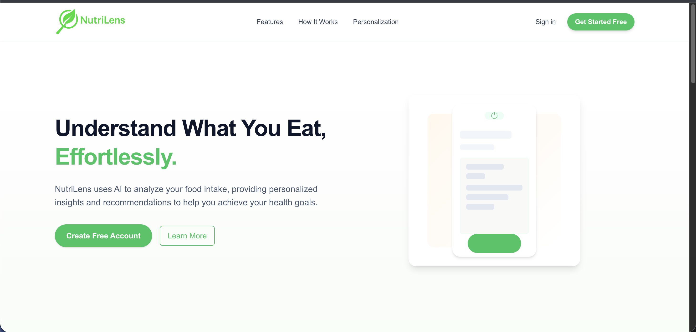
</p>

<p align="center">
  <a href="LICENSE"></a>
  
  
  
  
</p>

---

## 🗂️ Table of Contents
- [🚀 Tech Stack](#-tech-stack)
- [⚙️ Features Overview](#️-features-overview)
- [🧩 Folder Structure](#-folder-structure)
- [⚙️ Installation Guide](#️-installation-guide)
- [🚀 Deployment Guide (Vercel)](#-deployment-guide-vercel)
- [💾 Database Schema](#-database-schema-prisma)
- [📦 Available Scripts](#-available-scripts)
- [✨ Future Enhancements](#-future-enhancements)
- [👨‍💻 Contributors](#-contributors)
- [🛡️ License](#️-license)
- [💚 Acknowledgements](#-acknowledgements)
- [🎨 Application Showcase](#-application-showcase)

---

## 🚀 Tech Stack

| Layer | Technology |
|--------|-------------|
| **Frontend** | Next.js 15 (App Router, React 19) |
| **Backend** | Next.js API Routes (Node.js Runtime) |
| **Database** | NeonDB (PostgreSQL + Prisma ORM) |
| **Auth** | Firebase Authentication (Google Sign-In + Email) |
| **AI Model** | Google Gemini API (Generative AI) |
| **Styling** | Tailwind CSS + Shadcn UI |
| **Deployment** | Vercel |
| **Language** | TypeScript |

---

## ⚙️ Features Overview

### 👤 User Management
- 🔐 Secure Firebase Authentication (Google Sign-In, Email Sign-Up)  
- 🧾 Profile setup with personal details, health goals, and preferences  
- 🔁 Persistent onboarding with dynamic redirect  

### 🧠 AI-Powered Food Label Analysis
- 📸 Upload food or ingredient labels  
- 🤖 Gemini AI extracts and analyzes text (OCR built-in)  
- Detects ingredients, allergens, additives, nutrition, health score (0–10), and recommendations  

### 💊 Medicine Analysis
- Upload an image or type medicine name  
- AI identifies active ingredients, uses, side effects & precautions  
- Personalized compatibility score based on profile  

### 🩺 Symptom Checker
- Enter symptoms → AI returns probable conditions & advice  

### 📜 Health Tips
- Daily wellness tips generated via AI  

### 📚 History Dashboard
- View and delete past AI analyses synced with NeonDB  

### 🌓 Theme Support
- Global dark/light theme toggle (persistent per user)  

### 🌍 Scalable Architecture
- Next.js App Router + Prisma ORM + NeonDB  
- Future-ready for multilingual support (Hindi, Gujarati)  

---

## 🧩 Folder Structure

nutrilens/
├── prisma/
│   └── schema.prisma
├── src/
│   ├── app/
│   │   ├── api/
│   │   │   ├── ingredient/route.ts
│   │   │   ├── medicine/route.ts
│   │   │   ├── symptom-check/route.ts
│   │   │   ├── history/route.ts
│   │   │   └── profile/route.ts
│   │   └── (frontend pages)
│   ├── lib/
│   │   ├── prisma.ts
│   │   └── firebase.ts
│   ├── components/
│   ├── context/
│   └── styles/
├── .env
├── package.json
└── README.md

---

## ⚙️ Installation Guide

```bash
# 1️⃣ Clone repository
git clone https://github.com/NandCode24/nutrilens.git
cd nutrilens

# 2️⃣ Install dependencies
npm install

Create a .env file in the root directory:

DATABASE_URL="postgresql://<username>:<password>@<neon-host>/<db>?sslmode=require"
GEMINI_API_KEY=your_gemini_api_key

FIREBASE_API_KEY=your_firebase_api_key
FIREBASE_AUTH_DOMAIN=your_firebase_auth_domain
FIREBASE_PROJECT_ID=your_firebase_project_id
FIREBASE_STORAGE_BUCKET=your_firebase_storage_bucket
FIREBASE_MESSAGING_SENDER_ID=your_sender_id
FIREBASE_APP_ID=your_app_id

NEXTAUTH_URL=http://localhost:3000
NEXT_PUBLIC_APP_URL=https://nutrilens-yourproject.vercel.app

# 3️⃣ Generate Prisma client
npx prisma generate

# 4️⃣ Push schema to DB
npx prisma db push

# 5️⃣ Start dev server
npm run dev

👉 App runs at http://localhost:3000

⸻

🚀 Deployment Guide (Vercel)
	1.	Push repo to GitHub
	2.	Import project → Vercel Dashboard
	3.	Add same .env variables under Project Settings → Environment Variables
	4.	Deploy
	5.	Update:

NEXTAUTH_URL=https://your-vercel-app-url.vercel.app


	6.	Redeploy

⸻

💾 Database Schema (Prisma)

Table	Key Fields	Purpose
User	id, name, email, age, gender, heightCm, weightKg, allergies[]	Stores profile data
FoodScan	id, userId, ingredients[], allergens[], nutritionSummary, rating, recommendation	AI food label analysis
Medicine	id, userId, name, dosage, uses, precautions	AI medicine lookup


⸻

📦 Available Scripts

Command	Description
npm run dev	Start development server
npm run build	Build for production
npm start	Start production server
npx prisma studio	Open database viewer
npx prisma db push	Sync schema to NeonDB


⸻

✨ Future Enhancements
	•	🌍 Multi-language support (Hindi & Gujarati)
	•	📈 Nutrition tracking over time
	•	🧬 AI meal planning
	•	💬 Health chatbot
	•	📲 Mobile App (React Native)

⸻

👨‍💻 Contributors

Team BitByBit (TM180)
Design · Architecture · Coding · Testing
GitHub → @NandCode24

⸻

🛡️ License

Licensed under the MIT License.

⸻

💚 Acknowledgements
	•	🤖 Google Gemini API
	•	⚛️ Next.js
	•	🗄️ NeonDB
	•	🔥 Firebase Auth
	•	🎨 Tailwind CSS
	•	🚀 Vercel
	•	🧩 Prisma ORM

⸻

🎨 Application Showcase

Experience NutriLens in action — AI-powered nutrition with a beautiful UI 🌿

⸻


<p align="center">
  
</p>


⸻

🧾 Authentication Flow

<p align="center">
  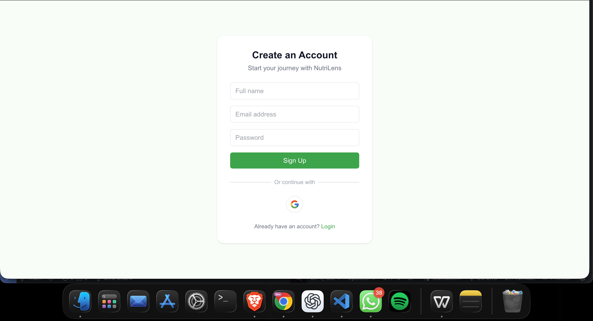
  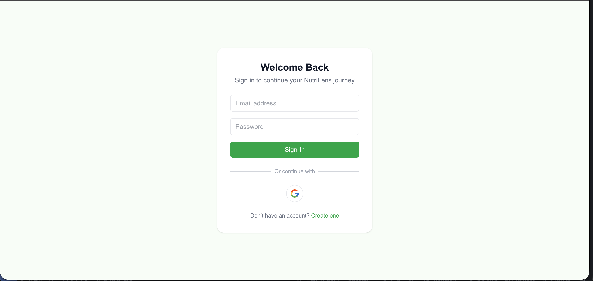
</p>


⸻

👤 Onboarding

<p align="center">
  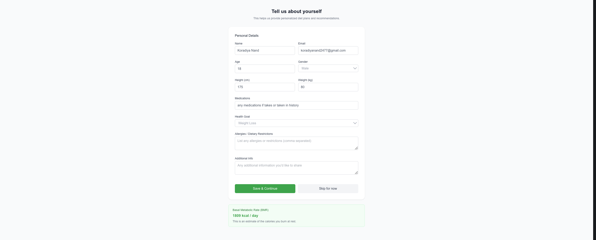
</p>


⸻

🥗 Ingredient Scanner

<p align="center">

  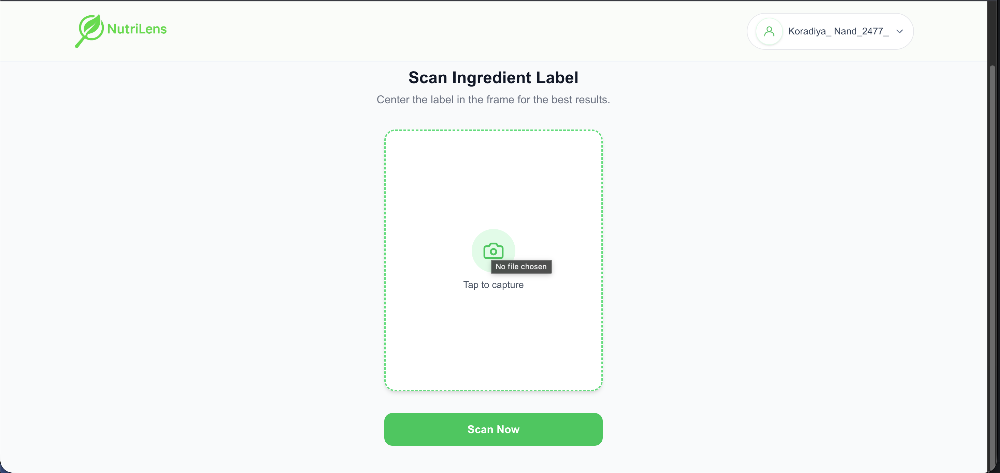

  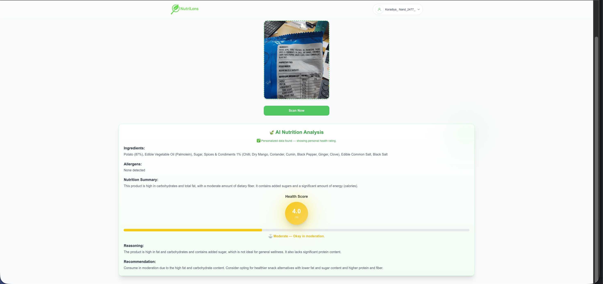
</p>


⸻

💊 Medicine Analyzer

<p align="center">
  
  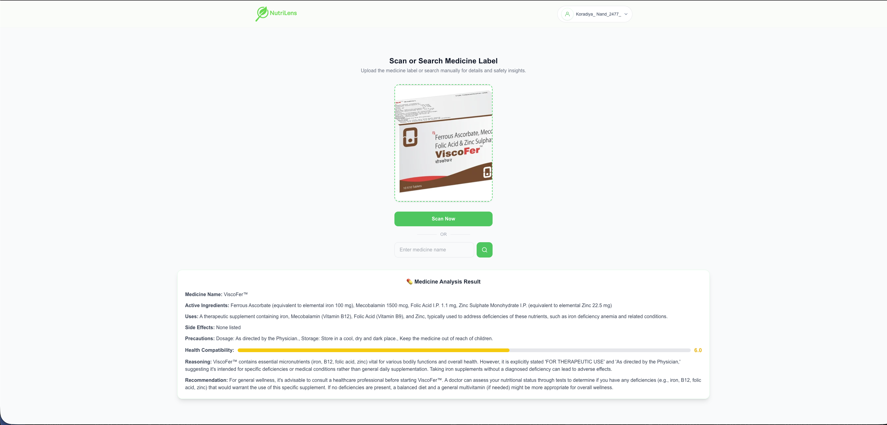
</p>


⸻

🧠 Symptom Checker

<p align="center">
  
  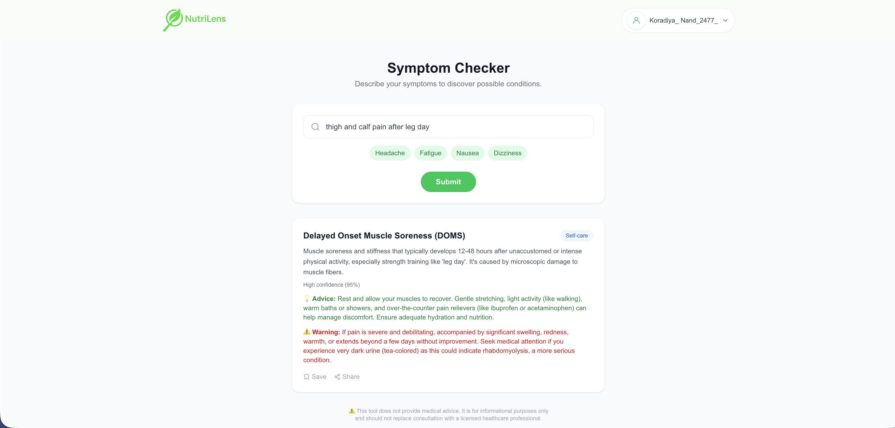
</p>


⸻

🌿 Health Tips

<p align="center">
  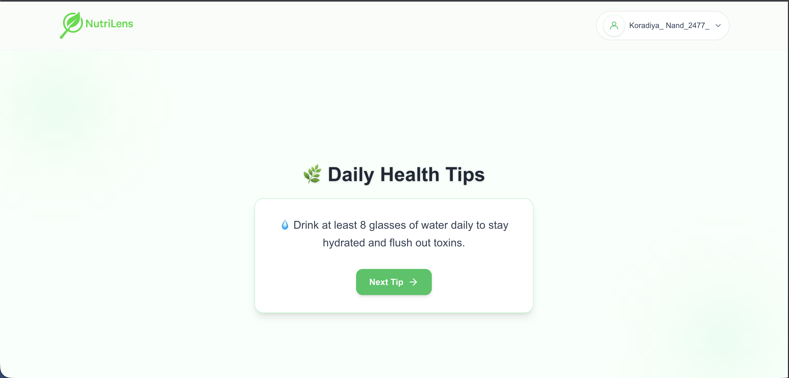
</p>


⸻

👤 Profile & 🕒 History

<p align="center">
  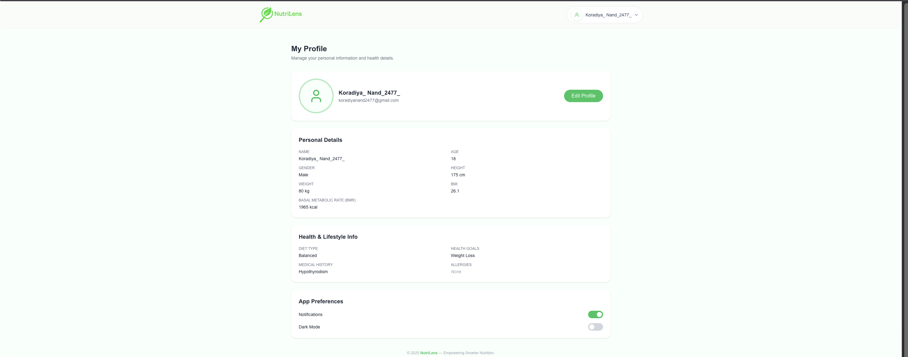
  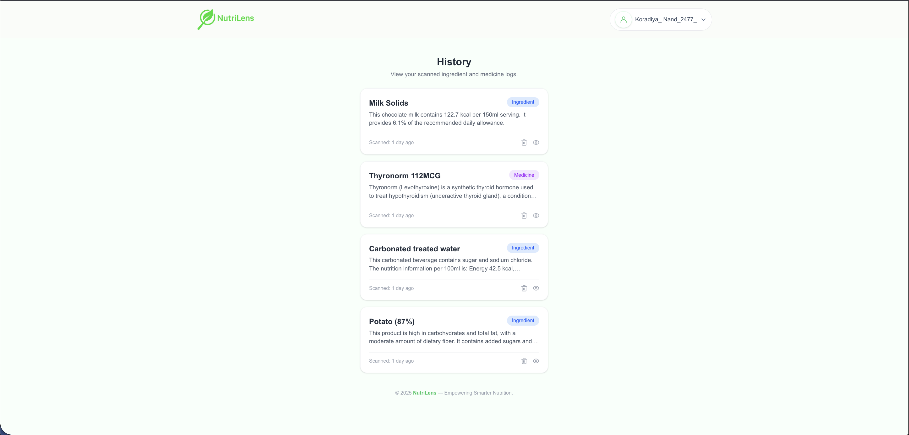
</p>


⸻


<h3 align="center">Made with 💚 by <b>Team BitByBit (TM180)</b> — Empowering Smarter, Healthier Living.</h3>
```

